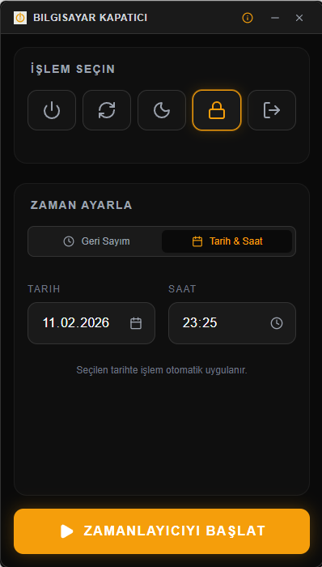
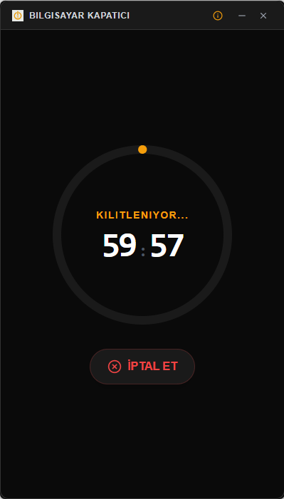

# ⏳ Bilgisayar Kapatıcı (PC Shutdown) v1.0.0

**[sc0x01.com](https://sc0x01.com)** tasarım felsefesiyle geliştirilmiş, minimalist, hızlı ve yüksek performanslı sistem zamanlayıcı aracı. Gereksiz hiçbir detay içermez, sadece işini yapar.

---

## 🚀 Temel Özellikler

- **Hassas Zamanlama:** `schtasks` bağımlılığı olmadan, Rust tabanlı saniye hassasiyetinde geri sayım.
- **Sessiz Çalışma (Silent Execution):** Windows görevlerini arka planda, hiçbir konsol penceresi açmadan sessizce yürütür.
- **Modern Arayüz:** Sade "Zinc & Amber" renk paleti ve Glassmorphism detaylarıyla premium kullanıcı deneyimi.
- **Çoklu İşlem:** Kapat, Yeniden Başlat, Uyku Modu, Kilitle ve Oturumu Kapat seçenekleri.
- **Tarih & Saat Desteği:** İster geri sayım başlatın, ister gelecekteki spesifik bir ana randevu verin.

## 📸 Ekran Görüntüleri

  
  
  

- **Taşınabilir (Portable):** Kurulum gerektirmez, tek bir `.exe` ile her yerde çalışır.

## 🛠️ Teknik Stack

- **Frontend:** React + TypeScript + Tailwind CSS
- **Backend:** Rust (Tauri v2)
- **Icons:** Lucide React
- **İletişim:** Tauri Asenkron Invoke (UI donmasını önleyen mimari)

## 📥 Kurulum ve Kullanım

1. [Releases](https://github.com/sc0x01/bilgisayar-kapatici/releases) sayfasından en güncel `.exe` dosyasını indirin.
2. Uygulamayı çalıştırın.
3. Yapılacak işlemi seçin, süreyi ayarlayın ve **BAŞLAT** deyin.
4. İptal etmek isterseniz tek tıkla geri sayımı durdurabilirsiniz.

---

## 🛡️ Güvenlik Notu
Uygulama sistemi kapatmak veya kilitlemek için standart Windows sistem komutlarını kullanır. Harici hiçbir script veya güvensiz yöntem çalıştırmaz. Kaynak kodları bu repoda şeffaf bir şekilde paylaşılmıştır. VirusTotal sonucu **0/71**'dir.

---

> **"Basitlik karmaşıklığın en üst noktasıdır."**  
> Geliştirilen: [sc0x01.com](https://sc0x01.com)
